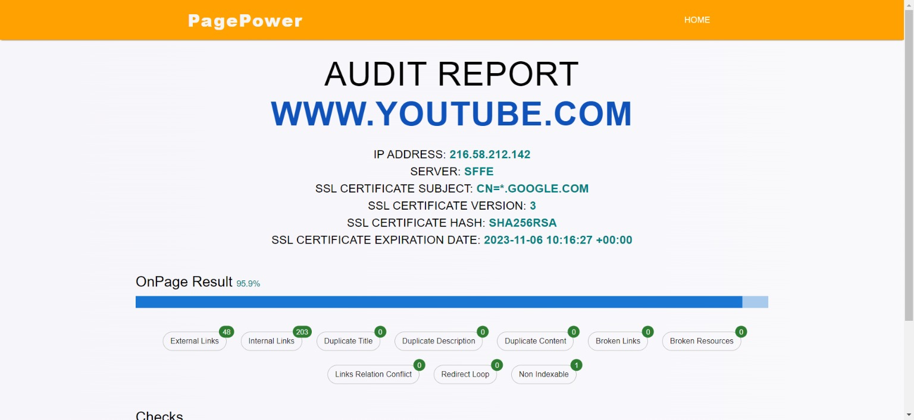

# PagePower - SEO Audit App



PagePower is a modern SEO audit app built with Vite and React. It allows you to analyze web pages for various SEO parameters and provides insights to improve your website's search engine optimization. This app utilizes the Dataforseo API to gather essential data for SEO analysis.

## Features

- Perform SEO audits on web pages.
- Analyze various SEO parameters.
- Get insights and recommendations for SEO improvement.

## Technologies Used

- React
- Vite
- React Router DOM
- Axios
- Material UI
- React Spinners
- React Hook Form
- React Hot Toast
- Dataforseo API

## Getting Started

Follow these instructions to get PagePower up and running on your local machine.

### Prerequisites

- Node.js installed (version 12 or higher)
- npm or Yarn package manager

### Installation

1. Clone the repository:

   ```bash
   git clone https://github.com/KamalJoshi-web/Seo-Audit-App.git
   ```

2. Navigate to the project directory:

   ```bash
   cd Seo-Audit-App
   ```

3. Install the dependencies using npm or Yarn:

   ```bash
   npm install
   # or
   yarn
   ```

4. Create a `.env` file in the root of your project and add your Dataforseo API credentials:

   ```env
   VITE_DATA_FOR_SEO_API_UNSERNAME=your-api-username
   VITE_DATA_FOR_SEO_API_PASSWORD=your-api-password
   ```

5. Start the development server:

   ```bash
   npm run dev
   # or
   yarn dev
   ```

6. Open your browser and visit [http://localhost:3000](http://localhost:3000) to use PagePower.

## Usage

1. Enter the URL of the web page you want to audit in the input field.
2. Click the "Try Now" button to initiate the SEO analysis.
3. PagePower will fetch data from the Dataforseo API and display the results.
4. Review the SEO audit report and use the insights to improve your website's SEO.

## Contributing

Contributions to PagePower are welcome! If you'd like to contribute, please follow these steps:

1. Fork the repository.
2. Create a new branch for your feature or bug fix.
3. Make your changes and commit them with clear and concise commit messages.
4. Push your changes to your fork.
5. Create a pull request to the `main` branch of the original repository.

## License

This project is licensed under the MIT License - see the [LICENSE](LICENSE) file for details.

## Acknowledgments

- Thanks to the creators of Vite, React, and all the libraries used in this project.
- Special thanks to Dataforseo for providing the SEO data and insights.

## Contact

If you have any questions or feedback, please contact us at [kamaljoshi1511@gmail.com](mailto:kamaljoshi1511@gmail.com).

Happy SEO auditing with PagePower! 🚀
